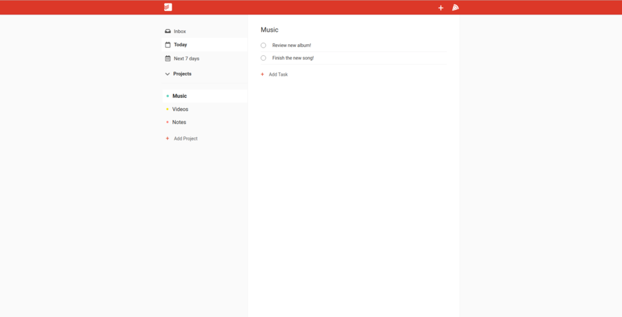

# Todoist Clone

This is a clone of the todo list app Todoist. Built with the help of React and Firebase.

The following functionality has been implemented:
  * Create a project
  * Delete a project
  * Create a todo item
  * Archive a todo item
  * Categorize todos based on deadline
  * Switch on / off dark mode

See original tutorial [here](https://github.com/karlhadwen/todoist).